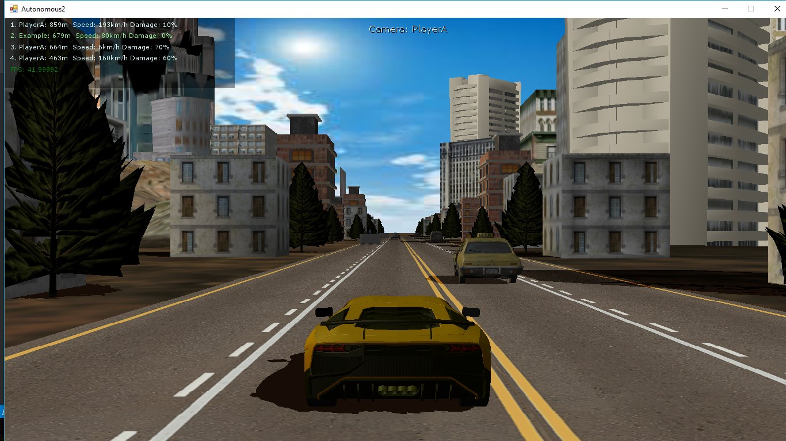
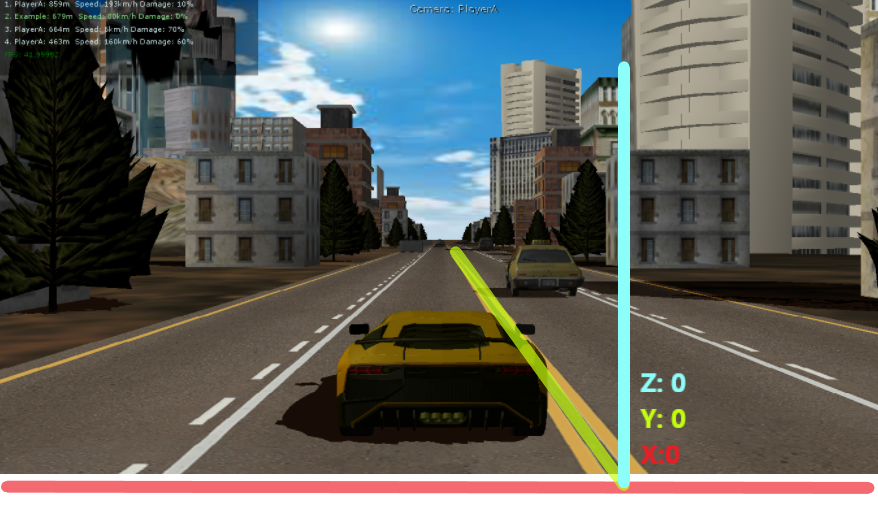

# Autonomous

Autonomous is a car game player AI framework written in [MonoGame](http://www.monogame.net/).
The goal of the game is implementing a player and reach the finish line before the others.

# How to setup

1. Install latest [Monogame SDK](http://www.monogame.net/downloads/)
2. Clone GitHub repository
```
git clone https://github.com/csombok/autonomous.git
```
3. Open solution in Visual Studio 2017
4. Build solution with AnyCPU configuration
5. Build solution with x64 configuration
6. Run autonomous.exe (GUI mode)

# Run game in interactive mode

The easiest way to test your player plugin is to run the game with GUI. 

Run with GUI:

```
autonomous.exe
```

GUI mode: 


# Run game in command line mode

You can run the application in CLI mode and customization is available by passing CLI option as follows:

## CLI parameters

* *-timeAcceleration*: time acceleration to speed up testing
* *-traffic*: traffic intensity (values: 0.1f - 1.0f defalt: 0.5f)
* *-length*: course length (default: 1000f)
* *-tournament*: tournament mode multiple rounds in one run
* *-rounds*: number of rounds in tournament mode

## Tournament mode

Tournament mode allows interactive game play for multiple players in multiple rounds in different scenarios.

```
autononous.exe -tournament
```

# Add new player

By implementing *IPlayer* interface you can add a new player to the game.
Each player plugin assembly has an isolated game loop by running a separate thread managed by the framework.

### Game loop events

* **Initialize**: Initialize the game play
* **Update**: Game loop update. It is invoked in every update cycle by passing *gameState* parameter consisting game object states.
* **Finish**: Game finish event

Check the *SamplePlayer* project to see how to implement a new player. 

```csharp
    [ExportMetadata("PlayerName", "Example")]
    public class SamplePlayer : IPlayer
    {
        private string _playerId;

        public void Initialize(string playerId)
        {
            _playerId = playerId;
        }

        public PlayerAction Update(GameState gameState)
        {
            // Add logic for game loop update
        }

        public void Finish()
        {
            // Add logic for game finish
        }

    }
```

# Game loop

In each iteration of the game loop players calculate the best action based on the provided game state.

```csharp
        public PlayerAction Update(GameState gameState)
        {
            // Add logic for game loop update
        }
```

Note: Each player has a separate game loop which is independent from the main game loop. If the calculation logic is slow the player can less frequenlty than a faster algorithm.

### Game state

The GameState class contains all necessary information about the game in each iteration.

```csharp
    /// <summary>
    /// State of the game. 
    /// </summary>
    public class GameState 
    {
        /// <summary>
        /// State of all objects the player interacts with, ordered by bounding box center ascending.
        /// </summary>
        public IReadOnlyList<GameObjectState> GameObjectStates { get; private set; }

        /// <summary>
        /// True if the game is finished, otherwise false.
        /// </summary>
        public bool Stopped { get; private set; }
    }

```
It contains the state (position, velocity etc.) of each object in the game area. Currently the following object types are supported:

- Player (other and the current player itself)
- Car (other cars on the road, not controlled by other players)
- Roadblock (non-moving object on the road)
- FinishLine (the end of the route)

Players can get their own state by filtering the GameObjectStates list by the id provided in the Initialize method.

```csharp
var self = gameState.GameObjectStates.First(o => o.Id == _playerId);
```

Useful constants are defined in GameConstants class.

### Game control actions

Players return the action they want to perform in each iteration. The number of different choices are very limited:

```csharp
    /// <summary>
    /// Action what the player performs in each loop.
    /// </summary>
    public class PlayerAction
    {
        /// <summary>
        /// Set true to move left.
        /// </summary>
        public bool MoveLeft { get; set; }
        /// <summary>
        /// Set true to move right.
        /// </summary>
        public bool MoveRight { get; set; }
        /// <summary>
        /// Acceleration in range (-1, 1). 1: Full acceleration, -1 Full deceleration. 
        /// </summary>
        public float Acceleration { get; set; }

```

### Collision and damage

After collisions players got damage and car's speed is decreased. 
The following rules are applied afer each collisions:

* Damage: **Damage(%) = Damage +10%**
* Speed: 
    - Head on collision: **Player Speed (Km/h) = 0**
    - Rear collision: **Player Speed (Km/h) = Other car's speed * 0.2**
* Maximum speed: **Maximum speed (Km/h) = Maximum speed * (Damage / 100 / 3)**

**Note: If player damage hits 100% then player car is stopped and the round score will be zero.**

# Coordinates

Game state and visualization uses a simple three axis coordinate system which is demonstrated below:



Please find some useful game constants below:

```csharp
        /// <summary>
        /// Full width of the road. (meter)
        /// </summary>
        public const float RoadWidth = 12f;
        /// <summary>
        /// Width of a lane. (meter)
        /// </summary>
        public const float LaneWidth = 3f;
        /// <summary>
        /// Acceleration of the players' car. (m/s2)
        /// </summary>
        public const float PlayerAcceleration = 10f;
        /// <summary>
        /// Deceleration of the players' car. (m/s2)
        /// </summary>
        public const float PlayerDeceleration = 18f;
        /// <summary>
        /// Maximum speed of players' car. (m/s)
        /// </summary>
        public const float PlayerMaxSpeed = 180f / 3.6f;
        /// <summary>
        /// Speed of players' car in left/right direction. (m/s)
        /// </summary>
        public const float PlayerHoriztontalSpeed = 5f;        
        /// <summary>
        /// Width of the players' cars
        /// </summary>        
        public const float PlayerCarWidth = 1.7f;      

```

# Scoring

After each game scores are saved to **results.csv** file in the following form:

Position | Name | Distance(m) | Damage(%) | Time(ms) | Score |
--- | --- | --- | --- | --- | ---- |
1 | PlayerA | 998 | 10 | 30366.7274 | 8
2 | Human | 755 | 10 | 30366.7274 | 4
3 | Example | 734 | 0 | 30366.7274 | 2

Score logic:

* Winner: **8pt**
* 2nd position: **4pt**
* 3rd position: **2pt**
* 4th position: **0pt**

## Viewport & Camera selection

### Viewport selection

GUI mode provides a manual viewport selection as follows:

* **F1**: select 1st player's viewport only
* **F2**: select 2nd player's viewport only
* **F3**: select 3rd player's viewport only
* **F4**: select 4th player's viewport only
* **F5**: show all players 
* **F9**: automatic viewport and camera mode

### Camera views

The following cameraviews can be selected:

* **F6**: birdview camera
* **F7**: inside camera
* **F8**: rear camera
